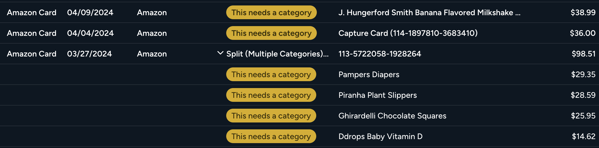
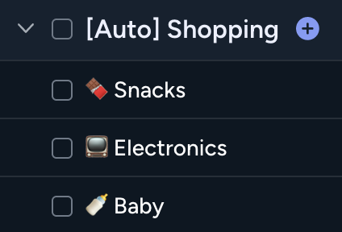

# YNAB_AMAZON - Upload your Amazon Receipts.
This repo takes your HTML Amazon receipts, parses them with ChatGPT, and uploads them to YNAB as split transactions. It's intended to be used in combination with the [Amazon Orders WebScrapper](https://github.com/aelzeiny/Amazon-Orders-WebScraper), which will do the actual receipt scrapping.

### What does this do?
It reads your Amazon receipts, and uploads every item into YNAB. The name of the item goes into the "memo" section so you know what it is that you purchased at a single glance. 

Transactions with multiple items are automatically split into multiple sub-transactions, as shown below.



Lastly, this repo does support auto-categorizing items. This behavior is **off-by-default**, because many people expressed strong disintrest in auto-categorization [[reddit thread](https://www.reddit.com/r/ynab/comments/1cg1uv7/) on why that's considered controversial]. However, if you're interested, create one or many category groups starting with the term "[Auto]" (case-insensitive), then run the script with the `--categorize` flag.




### Example Usage:
```
python main.py -a account_uuid -i ./receipts -db .db.sqlite
```

For auto-categorization use:
```
python main.py -a account_uuid -i ./receipts -db ./db.sqlite --categorize
```

### Why?
* The wonderful minds behind the **AWS CLOUD** cannot provide an OAuth API 🙃
* Amazon is mostly server-side generated, and AFAIK there's no direct API call that can grab these details.
* Amazon killed the "download orders as CSV" feature.

### Auto-categorization
The `-c true` flag will attempt to auto-categorize transactions for you based on category groups that start with "[auto]". By default this behavior is turned off.